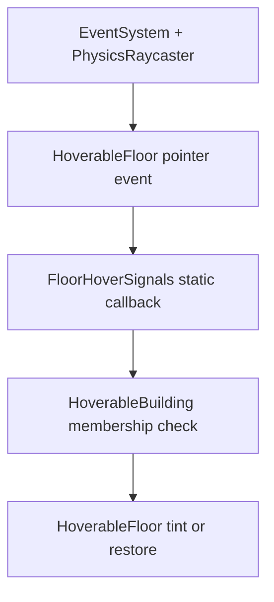

# UIT GIS Demo — Building E Floor Hover Highlight Plan

## 1. Objective

Implement mouse-hover highlighting for floors inside `Building_E` only.

When the pointer is over a valid floor, every visible renderer belonging to that floor receives a subtle light-yellow tint. When the pointer leaves, the floor must return exactly to its previous visual state.

This plan is the implementation contract for the coding Agent. It does not authorize unrelated camera, movement, building, Web, model or UI changes.

---

## 2. Scope decision

| Item | Decision |
| --- | --- |
| Git branch | `feature/building-e-floor-hover` |
| Current implementation scope | `Building_E` only |
| Building component | `HoverableBuilding.cs` on `Building_E` |
| Floor component | `HoverableFloor.cs` on each valid `E_floor_*` child |
| Floor identity | Parsed once from `{buildingId}_floor_{floorId}` when the component is added |
| ID types | `string`, because `E_floor_G` is valid |
| Hover input | Unity EventSystem pointer events against 3D colliders |
| 3D raycaster | `PhysicsRaycaster` on the active gameplay camera |
| Visual technique | `MaterialPropertyBlock` color override |
| Highlight color | Light yellow, initial proposal `#FFF2A6` |
| Original-material mutation | Forbidden |
| Other buildings | Must remain unchanged |
| Addressables/Resources | Not needed |
| New custom manager | Not needed |
| New feature prefab | Not needed unless `_InitManager` must host a missing EventSystem |
| First validation target | Current scene in Editor Play Mode |

The solution must be reusable: later, another building can opt in by receiving one `HoverableBuilding` component and `HoverableFloor` components on its floor children. No other building is opted in during this task.

---

## 3. Observed scene/model baseline

The supplied screenshot shows the unpacked FBX instance under approximately this hierarchy:

```text
TestScene
├── Directional Light
└── CampusRoot
    └── CampusVisualRoot
        └── map_splitE_v2
            ├── Building_E
            │   ├── E_floor_3
            │   ├── E_floor_4
            │   ├── E_floor_5
            │   ├── E_floor_6
            │   ├── E_floor_7
            │   ├── E_floor_9
            │   ├── E_floor_8
            │   ├── E_floor_10
            │   ├── E_floor_11
            │   ├── E_floor_2
            │   ├── E_straight_stair1
            │   ├── E_straight_stair2
            │   ├── E_floor_1
            │   ├── E_floor_12
            │   ├── E_floor_G
            │   └── Mesh54
            ├── Building_C
            ├── Building_B
            ├── Building_D
            └── ...
```

Do not depend on sibling order. The screenshot proves that numeric floors are not sorted numerically in the hierarchy.

### 3.1. Valid Building E floors

Exactly these direct children are in scope:

```text
E_floor_G
E_floor_1
E_floor_2
E_floor_3
E_floor_4
E_floor_5
E_floor_6
E_floor_7
E_floor_8
E_floor_9
E_floor_10
E_floor_11
E_floor_12
```

Expected floor count: **13**.

### 3.2. Explicit exclusions

Do not add `HoverableFloor` or hover colliders to:

- `E_straight_stair1`.
- `E_straight_stair2`.
- `Mesh54`.
- `Building_C`.
- `Building_B`.
- `Building_D`.
- Any other campus object.

Do not rename or reorder FBX children to make discovery easier.

---

## 4. Hard constraints

### 4.1. Project conventions

- All C# files must be created under `Assets/Script/`.
- Any new prefab must be created under `Assets/Prefabs/`.
- Do not introduce Addressables.
- Do not use `Resources.Load` or `Resources.LoadAsync` because this feature needs no runtime-loaded asset.
- Continue to start from the current scene; do not create a loading scene.
- If global initialization infrastructure is needed, use the existing `_InitManager` prefab or create it under `Assets/Prefabs/System/`.
- Do not create a second manager root beside `_InitManager`.
- Follow SOLID, Clean Code and a clear separation of responsibilities.
- Cross-system communication must use static callbacks/signals.
- Do not use `FindObjectOfType`, `FindFirstObjectByType`, `FindAnyObjectByType`, `GameObject.Find` or repeated tag lookup.
- Hierarchy-local `GetComponentsInChildren` performed once and cached is allowed.

### 4.2. Model and visual safety

- The FBX instance is unpacked, but do not edit the source FBX asset.
- Do not modify mesh vertices, transforms, UVs or import settings.
- Do not replace shaders or materials.
- Do not write to `renderer.sharedMaterial`.
- Do not use `renderer.material`, because it creates material instances.
- Do not create one highlight material per floor.
- Do not add emission or post-processing as part of this feature.
- Do not change the current camera controls.

### 4.3. Identity rules

- Field names must be `buildingId` and `floorId`, not `floodId`.
- Both fields must be serialized strings and manually editable in the Inspector.
- Parse IDs only when the component is first assigned through `MonoBehaviour.Reset()`.
- Do not parse or overwrite IDs in `OnValidate`.
- Do not continuously synchronize IDs with GameObject names.
- Do not parse IDs in `Awake`, `Start` or every frame.
- If parsing fails, leave both fields empty so the user can enter them manually.
- Renaming a GameObject after component assignment must not silently rewrite saved IDs.

---

## 5. Architecture

Use Unity EventSystem pointer events instead of a custom per-building `Update()` raycast. A single camera `PhysicsRaycaster` can support Building E now and other opt-in buildings later.



Responsibilities:

| Type | Responsibility |
| --- | --- |
| `HoverableFloor` | Own floor metadata, receive pointer events, cache render state, apply/restore tint |
| `HoverableBuilding` | Own building-level hover policy, valid-floor registry, current hovered floor and highlight configuration |
| `FloorNameParser` | Pure parsing of `{buildingId}_floor_{floorId}` |
| `FloorHoverSignals` | Static event channel between pointer target and building aggregate/future UI |
| Unity `PhysicsRaycaster` | Convert pointer position into 3D collider hits |
| Unity `EventSystem` | Dispatch pointer-enter and pointer-exit events |

`HoverableBuilding` may directly call methods on cached child `HoverableFloor` instances. This is communication inside one building aggregate, not scene-wide object discovery. Communication outside the aggregate uses `FloorHoverSignals`.

---

## 6. Planned file structure

Create:

```text
Assets/
├── Script/
│   ├── Campus/
│   │   └── Buildings/
│   │       ├── HoverableBuilding.cs
│   │       ├── HoverableFloor.cs
│   │       └── FloorNameParser.cs
│   ├── Core/
│   │   └── Signals/
│   │       └── FloorHoverSignals.cs
│   └── Tests/
│       └── EditMode/
│           └── FloorNameParserTests.cs  # only if Test Framework already exists
└── Prefabs/
    └── System/
        └── _InitManager.prefab          # reuse/create only if EventSystem infrastructure is absent
```

Do not create an `.asmdef` solely for this feature unless the existing project already organizes feature code through assembly definitions.

---

## 7. Floor name parsing contract

`FloorNameParser` must be a pure utility with no scene lookup and no dependency on `MonoBehaviour`.

Recommended API:

```csharp
public static bool TryParse(
    string objectName,
    out string buildingId,
    out string floorId);
```

Parsing rules:

1. Look for the exact, case-sensitive delimiter `_floor_` and require it to occur exactly once.
2. Text before the delimiter is `buildingId`.
3. Text after the delimiter is `floorId`.
4. Both sides must contain at least one non-whitespace character.
5. Trim accidental outer whitespace from parsed values.
6. Return `false` and set both outputs to `string.Empty` when invalid.
7. Do not convert `floorId` to an integer.

Expected examples:

| GameObject name | Result | `buildingId` | `floorId` |
| --- | --- | --- | --- |
| `E_floor_G` | Success | `E` | `G` |
| `E_floor_1` | Success | `E` | `1` |
| `E_floor_12` | Success | `E` | `12` |
| `E_straight_stair1` | Failure | empty | empty |
| `Building_E` | Failure | empty | empty |
| `E_floor_` | Failure | empty | empty |
| `_floor_1` | Failure | empty | empty |
| `E_Floor_1` | Failure | empty | empty |

Avoid a regex unless it makes the implementation clearer. Splitting around one exact delimiter is sufficient and easier to test.

---

## 8. `HoverableFloor` design

### 8.1. Serialized data

Minimum serialized fields:

```csharp
[SerializeField] private string buildingId = string.Empty;
[SerializeField] private string floorId = string.Empty;
[SerializeField] private Renderer[] targetRenderers;
```

Expose read-only runtime properties:

```csharp
public string BuildingId => buildingId;
public string FloorId => floorId;
```

Do not expose public mutable fields.

### 8.2. Assignment-time initialization

Implement `Reset()`:

1. Set `buildingId` and `floorId` to empty.
2. Call `FloorNameParser.TryParse(gameObject.name, ...)`.
3. Assign both fields only when parsing succeeds.
4. Collect this floor's child renderers once into `targetRenderers`.
5. If parsing fails, leave fields empty without guessing.

`Reset()` is the correct lifecycle hook because Unity invokes it in Edit Mode when a component is first added. Do not implement identity fetching in `OnValidate`.

Optional explicit tooling is allowed:

```text
Context menu: Refresh Renderer Cache
```

If provided, it must refresh renderers only. It must not silently reparse IDs. The user can manually edit IDs after a failed parse.

### 8.3. Pointer-event responsibility

Implement:

```csharp
IPointerEnterHandler
IPointerExitHandler
```

Behavior:

- `OnPointerEnter` raises a static enter signal containing `this`.
- `OnPointerExit` raises a static exit signal containing `this`.
- Do not search for `HoverableBuilding` from the floor.
- Do not directly search for or call UI managers.
- Repeated enter events for the same active target must be harmless.

### 8.4. Highlight responsibility

Provide narrowly scoped methods for the owning building:

```csharp
public void ApplyHighlight(Color tint, float blendStrength);
public void ClearHighlight();
```

Requirements:

- Cache renderer/material-slot state before the first highlight.
- Support multiple renderers under one floor.
- Support multiple material slots per renderer.
- Prefer the URP/Lit property `_BaseColor`.
- Fall back to `_Color` for compatible non-URP materials.
- Skip unsupported material slots and log at most one useful warning per floor.
- Preserve source alpha.
- Compute a tint such as `Color.Lerp(originalColor, tint, blendStrength)`.
- Apply only when hover state changes, not every frame.
- `ClearHighlight()` restores the original property blocks exactly.
- `OnDisable` and `OnDestroy` must restore the original visual state.
- Repeated clear calls must be safe.

### 8.5. Material state strategy

Create a small cached state per renderer/material index containing:

- Renderer reference.
- Material slot index.
- Supported color-property ID.
- Original material color.
- Original `MaterialPropertyBlock` for that material slot.

When highlighting:

1. Start from the existing per-slot property block so unrelated overrides are retained.
2. Override only `_BaseColor` or `_Color`.
3. Call `Renderer.SetPropertyBlock(block, materialIndex)`.

When clearing:

1. Restore the cached original property block for that material slot.
2. Do not approximate restoration by writing a hard-coded white color.

This avoids material duplication and prevents shared materials on other buildings from changing.

---

## 9. `HoverableBuilding` design

### 9.1. Serialized data

Recommended fields:

```csharp
[SerializeField] private string buildingId = string.Empty;
[SerializeField] private Color hoverTint = new(1f, 0.949f, 0.651f, 1f);
[SerializeField, Range(0f, 1f)] private float hoverBlendStrength = 0.4f;
[SerializeField] private HoverableFloor[] floors;
```

`#FFF2A6` at approximately `0.4` blend strength is an initial value. It may be tuned in the Inspector for visibility, but it must remain a light-yellow tint and must not become emissive.

### 9.2. Building initialization

When `HoverableBuilding` is added to `Building_E`, `Reset()` may derive `buildingId = "E"` from the exact prefix `Building_`.

Rules:

- If derivation fails, leave `buildingId` empty for manual input.
- Do not use `OnValidate`.
- Do not reparse during runtime.
- Cache `GetComponentsInChildren<HoverableFloor>(true)` once during initialization.
- A hierarchy-local cached lookup is allowed; a scene-wide Find call is not.
- Warn if zero floors are registered.
- Warn if a registered floor has a non-empty `BuildingId` that differs from the building's non-empty ID.
- A metadata warning must not crash highlighting for a floor that is still an actual child.

### 9.3. Event lifecycle

In `OnEnable`:

- Subscribe to `FloorHoverSignals.PointerEntered`.
- Subscribe to `FloorHoverSignals.PointerExited`.

In `OnDisable`:

- Unsubscribe from both signals.
- Clear the currently highlighted floor.
- Reset the current-floor reference.

Never subscribe in a way that can accumulate duplicate static handlers after Play Mode reloads.

### 9.4. Membership and state transitions

Maintain a cached membership set and one `currentFloor` reference.

On enter:

1. Ignore null.
2. Ignore a floor not owned by this building.
3. If it is already current, do nothing.
4. Clear the old current floor, if any.
5. Set the new current floor.
6. Apply the configured tint once.

On exit:

1. Ignore null.
2. Ignore a floor not owned by this building.
3. Clear only if the exiting floor is the current floor.
4. Set current floor to null.

Only one floor per building can remain highlighted.

---

## 10. Static signal design

`FloorHoverSignals` is a static event hub, not a singleton MonoBehaviour.

Recommended contract:

```csharp
public static event Action<HoverableFloor> PointerEntered;
public static event Action<HoverableFloor> PointerExited;
```

Provide internal/static raise methods so event invocation stays inside the signal type.

Requirements:

- Null senders are ignored.
- No static reference to a camera, building or scene object is stored after dispatch.
- Clear static subscribers at `RuntimeInitializeLoadType.SubsystemRegistration` so Enter Play Mode with domain reload disabled does not retain stale handlers.
- Do not implement a scene singleton.
- Future floor-information UI may subscribe to these signals instead of finding `Building_E`.

---

## 11. EventSystem and camera setup

### 11.1. Reuse before creating

Inspect the current scene first:

- If an active `EventSystem` already exists, reuse it.
- Do not create a duplicate EventSystem.
- Do not replace its input module if current UI/input already works.
- If none exists, create one using the input backend already configured by the project.

Input-module rule:

- New Input System: use `InputSystemUIInputModule`.
- Legacy Input Manager: use `StandaloneInputModule`.
- Do not change **Active Input Handling** or add an input package for this feature.

### 11.2. `_InitManager` placement

If a new EventSystem is required:

1. Reuse the existing `_InitManager` prefab if present.
2. Add a child named `EventSystem` beneath `_InitManager`.
3. Put Unity's `EventSystem` and the correct input-module component on that child.
4. Apply the change to the prefab under `Assets/Prefabs/`.

If `_InitManager` does not exist:

1. Create `Assets/Prefabs/System/_InitManager.prefab`.
2. Add one instance to the current scene.
3. Add the `EventSystem` child described above.

Do not add custom floor-hover behavior to `_InitManager`; it only hosts global input-dispatch infrastructure when needed.

### 11.3. Active camera

Identify the Camera component actually rendering the Game view. It might be the scene's `Main Camera` or a child of the current camera rig.

Add one `PhysicsRaycaster` to that Camera.

Configure:

- Event Mask: only the `FloorHover` layer.
- Max Ray Intersections: leave default unless profiling proves a need.

Do not add PhysicsRaycaster to an inactive or duplicate camera.

### 11.4. Cursor condition

Pointer hover requires an available pointer position.

- Do not change the current camera-control scheme.
- Test while `Cursor.lockState == CursorLockMode.None` and the pointer is visible.
- If the current controller permanently locks the cursor, record an input-integration blocker rather than silently changing camera behavior in this task.

---

## 12. Layer and collider setup

### 12.1. Dedicated layer

Add a project layer named:

```text
FloorHover
```

Use the first appropriate free user-layer slot; do not hard-code a numeric layer index in scripts.

Assign `FloorHover` only to the collider-bearing objects of the 13 Building E floors. Do not assign the layer to stairs, `Mesh54` or other buildings.

### 12.2. Collider policy

Every hoverable visible mesh region must be reachable through a 3D Collider whose transform is the floor itself or a descendant of that floor.

Preferred setup:

- If `E_floor_*` has its own `MeshFilter`, add a non-convex `MeshCollider` on the same GameObject and use its shared mesh.
- If the Floor is a grouping root with mesh-bearing descendants, add colliders to those mesh-bearing descendants.
- Apply the `FloorHover` layer recursively to the actual collider GameObjects.
- Keep colliders non-trigger.
- Do not add Rigidbody components.
- Do not mark complex static building floors as convex merely to satisfy a Rigidbody; no Rigidbody is needed.

If an existing collider accurately covers a floor, reuse it and only configure the dedicated layer.

Do not add one collider to the whole `Building_E`; the raycast must resolve the individual `HoverableFloor` parent.

### 12.3. Collider quality check

Use Scene view collider visualization and verify:

- Each visible floor facade can be pointed at.
- Adjacent floors do not have large overlapping collider volumes.
- The roof/ground boundary selects the visually nearest valid floor.
- Stairs and `Mesh54` have no `FloorHover` collider.

For this 13-floor spike, accurate static MeshColliders are acceptable. Simplified proxy colliders are a later optimization only if profiling shows a real cost.

---

## 13. Component assignment procedure

Perform after all scripts compile without errors.

### 13.1. Building component

1. Select `Building_E`.
2. Add `HoverableBuilding`.
3. Verify `buildingId` is `E`; enter it manually if empty.
4. Set `hoverTint` to light yellow `#FFF2A6`.
5. Start with `hoverBlendStrength = 0.4`.

Do not add the component to any sibling building in this task.

### 13.2. Floor components

Multi-select only the 13 valid `E_floor_*` direct children and add `HoverableFloor` once to the selection.

For every floor, verify:

| Name | Expected `buildingId` | Expected `floorId` |
| --- | --- | --- |
| `E_floor_G` | `E` | `G` |
| `E_floor_1` | `E` | `1` |
| ... | `E` | ... |
| `E_floor_12` | `E` | `12` |

If any value is empty:

- Confirm the object name.
- Enter the two IDs manually in the Inspector.
- Do not add `OnValidate` or a runtime name parser to hide the setup failure.

Verify each floor's `targetRenderers` contains only that floor's renderers.

### 13.3. Refresh building registry

Because `HoverableBuilding` might have been added before floor components, refresh/reassign its cached `floors` list using its explicit setup method/context command or by resetting only its registry field.

Expected registry count: **13**.

Do not use a per-frame discovery call.

---

## 14. Implementation phases

### Phase 0 — Git and baseline safety

Run:

```bash
git status --short
git branch --show-current
git rev-parse --short HEAD
```

Rules:

- Branch from the current functional project state containing the unpacked `Building_E` model.
- Do not assume the Web smoke-test branch is the correct feature base.
- Do not stash, reset, clean or discard user changes automatically.
- If unrelated uncommitted changes exist, stop and ask how to preserve them.

Create and verify:

```bash
git switch -c feature/building-e-floor-hover
git branch --show-current
```

### Phase 1 — Identity and signal code

1. Create `FloorNameParser.cs`.
2. Create parser EditMode tests if the test framework already exists.
3. Create `FloorHoverSignals.cs`.
4. Compile and resolve errors before proceeding.

### Phase 2 — Floor visual component

1. Create `HoverableFloor.cs`.
2. Implement `Reset()` parsing and renderer collection.
3. Implement pointer enter/exit handlers.
4. Implement cached MaterialPropertyBlock tint and exact restoration.
5. Compile before scene changes.

### Phase 3 — Building coordinator

1. Create `HoverableBuilding.cs`.
2. Implement cached floor membership.
3. Implement static-event subscription lifecycle.
4. Implement one-current-floor state transitions.
5. Compile before component assignment.

### Phase 4 — Scene infrastructure

1. Reuse or create exactly one EventSystem.
2. Use the current project's existing input backend.
3. Put newly required global infrastructure in `_InitManager`.
4. Add `PhysicsRaycaster` to the actual gameplay Camera.
5. Add/configure the `FloorHover` layer.

### Phase 5 — Building E setup

1. Add `HoverableBuilding` only to `Building_E`.
2. Add `HoverableFloor` only to the 13 exact `E_floor_*` children.
3. Verify all parsed IDs.
4. Cache the correct renderers.
5. Add/reuse per-floor colliders.
6. Assign collider objects to `FloorHover`.
7. Verify the building registry count is 13.

### Phase 6 — Editor validation

Run the test matrix in Section 15. Fix only implementation defects inside this feature's scope.

### Phase 7 — Diff audit and handoff

Inspect every changed asset and report results. Do not fold Web publishing, building selection, UI panels or floor isolation into this branch.

---

## 15. Manual test matrix

### 15.1. Identity tests

- `E_floor_G` displays `buildingId = E`, `floorId = G`.
- `E_floor_1` displays `buildingId = E`, `floorId = 1`.
- `E_floor_12` displays `buildingId = E`, `floorId = 12`.
- All 13 valid floors have non-empty IDs.
- Sibling order has no effect on identity.
- Stairs and `Mesh54` have no `HoverableFloor`.
- No `OnValidate` reparses values after a manual Inspector edit.

### 15.2. Basic hover tests

- Hover `E_floor_G`: only ground floor gains a light-yellow tint.
- Hover a middle floor: only that floor gains the tint.
- Hover `E_floor_12`: only floor 12 gains the tint.
- Move directly from one floor to another: the previous floor restores and the new floor highlights.
- Move pointer into empty sky/ground: the last floor restores.
- Move pointer over stairs or `Mesh54`: no floor highlights from those objects.
- At most one Building E floor is highlighted at a time.

### 15.3. Visual integrity tests

- Original textures remain visible beneath the tint.
- Original alpha remains unchanged.
- Tint is light yellow, not white, orange or emissive neon.
- Leaving hover restores the exact previous appearance.
- Repeated enter/exit cycles do not progressively change color.
- Disabling `Building_E` while hovered does not leave stale highlight state.
- Exiting Play Mode leaves no material asset dirty.
- No runtime material instances accumulate in the Memory Profiler/Inspector.

### 15.4. Isolation tests

- Hovering `Building_C`, `Building_B`, `Building_D` or any other campus object produces no highlight.
- A shared material used by another building never changes when Building E highlights.
- Existing camera controls continue to behave exactly as before.
- Existing UI interaction continues to work.
- A UI element under the cursor takes pointer priority; the floor behind it must not highlight unexpectedly.

### 15.5. Camera-angle and collider tests

- Test Building E from the front facade.
- Test from both side facades.
- Test from a high oblique view.
- Test near boundaries between consecutive floors.
- Test while the camera is stationary and immediately after pan/zoom/rotate.
- No large invisible collider region triggers a floor when the pointer is clearly outside its visible area.

### 15.6. Performance tests

- No `GetComponentsInChildren`, material allocation or parser call occurs every frame.
- No per-frame garbage allocation is introduced by hover state handling.
- Pointer movement across the facade remains visually responsive.
- Highlight application occurs only when the active floor changes.

---

## 16. Automated tests

If Unity Test Framework is already installed, create EditMode tests under `Assets/Script/Tests/EditMode/` for `FloorNameParser`.

Minimum cases:

```text
E_floor_G        -> true,  E, G
E_floor_1        -> true,  E, 1
E_floor_12       -> true,  E, 12
E_floor_         -> false, empty, empty
_floor_1         -> false, empty, empty
E_stair_1        -> false, empty, empty
Building_E       -> false, empty, empty
null             -> false, empty, empty
empty            -> false, empty, empty
whitespace       -> false, empty, empty
```

Do not install a test package solely for this small feature. If the framework is absent, execute the identity cases manually and document them.

---

## 17. Failure handling

| Failure | Required response |
| --- | --- |
| ID parsing fails | Leave both fields empty; allow manual entry |
| Floor has no renderer | Warn with hierarchy path; do not crash |
| Material lacks `_BaseColor` and `_Color` | Skip that material slot; warn once |
| Floor has no collider | It cannot receive pointer events; fix scene collider setup |
| Wrong camera has PhysicsRaycaster | Move/reassign it to the active gameplay camera |
| Duplicate EventSystems | Keep one compatible instance; do not leave both active |
| Input module mismatch | Use the project's existing input backend; do not change backend |
| Cursor is permanently locked | Report camera/input integration blocker |
| Other building highlights | Remove its opt-in components/layer; verify Building E membership |
| Tint remains after exit | Fix cached property-block restoration before handoff |
| Shared material changes globally | Remove direct material mutation and use MaterialPropertyBlock |

Do not solve setup failures by adding scene-wide searches or continuous `OnValidate` synchronization.

---

## 18. Acceptance criteria

The feature is accepted only when all statements are true:

### Code and architecture

- [ ] All new code is under `Assets/Script/`.
- [ ] `HoverableBuilding.cs` is reusable and attached only to `Building_E`.
- [ ] `HoverableFloor.cs` is attached to exactly 13 valid Building E floors.
- [ ] `FloorNameParser` is pure and tested/manual-verified.
- [ ] IDs are initialized by `Reset()` only.
- [ ] No identity parsing exists in `OnValidate`, `Awake`, `Start` or Update loops.
- [ ] Failed parsing leaves editable empty fields.
- [ ] Static callbacks handle cross-system communication.
- [ ] Static subscriptions are cleaned up safely.
- [ ] No scene-wide Find API is used.

### Visual behavior

- [ ] Hovered floor receives a visible light-yellow tint.
- [ ] Only one Building E floor is highlighted.
- [ ] Moving away restores the exact original visual state.
- [ ] Other buildings, stairs and `Mesh54` never highlight.
- [ ] No material asset or shared material is modified.
- [ ] Multiple renderers/material slots per floor are supported.

### Scene setup

- [ ] The active Camera has one PhysicsRaycaster.
- [ ] The scene has exactly one compatible EventSystem.
- [ ] The PhysicsRaycaster mask targets `FloorHover` only.
- [ ] Each valid floor has accurate collider coverage.
- [ ] No other campus object is assigned to `FloorHover`.
- [ ] `_InitManager` contains any newly required global initialization infrastructure.

### Regression safety

- [ ] Current camera controls are unchanged.
- [ ] Current scene still starts directly.
- [ ] No Addressables or runtime Resources load was added.
- [ ] No source FBX/model transform/import setting was changed.
- [ ] Editor Console has no new error.
- [ ] No per-frame material or collection allocation is introduced.

---

## 19. Git diff audit

Before committing:

```bash
git status --short
git diff --stat
git diff
```

Expected changes:

- New scripts under `Assets/Script/` and their `.meta` files.
- Current scene serialization for Building E components, colliders, layers and camera raycaster.
- `ProjectSettings/TagManager.asset` for the `FloorHover` layer.
- Existing/new `_InitManager` prefab and `.meta` only if EventSystem infrastructure was absent.
- Parser tests only if the existing test framework is used.

Unexpected changes requiring review:

- Source FBX or `.fbx.meta`.
- Materials, textures or shaders.
- Other building hierarchy/components.
- Camera-control scripts or input-action assets.
- Package manifest or lock file.
- Web build output.

Suggested commits:

```text
feat(building): add reusable floor hover components
feat(scene): configure Building E floor hover targets
test(building): cover floor name parsing
```

The test commit is optional when the project has no existing Test Framework.

---

## 20. Out of scope

- Clicking/selecting a floor.
- Keeping a floor selected after hover ends.
- Isolating or exploding building floors.
- Hiding roofs or other floors.
- Loading detailed interior models.
- Room-level interaction.
- IoT markers, realtime data or information panels.
- Applying the feature to Building B/C/D or other campus buildings.
- Runtime discovery of all campus buildings.
- Touch/mobile hover emulation.
- Changing the camera controller or input mapping.
- Rebuilding or republishing the Unity Play deployment.
- Next.js integration.

These should be separate follow-up tasks after the Building E hover spike is stable.

---

## 21. Handoff report

The Agent must report:

1. Source branch and commit.
2. Feature branch and final commit(s).
3. Exact scene path modified.
4. All code files created.
5. Whether `_InitManager`/EventSystem had to be created or reused.
6. Active camera receiving `PhysicsRaycaster`.
7. The user-layer slot used for `FloorHover`.
8. Floor registry count; expected `13`.
9. Parsed `(buildingId, floorId)` for every floor.
10. Renderer/collider setup exceptions, if any.
11. Shader/material slots skipped, if any.
12. Manual and automated test results.
13. Confirmation that other buildings and shared materials remained unchanged.
14. Known limitations and the smallest appropriate follow-up task.

---

## 22. Relevant Unity 6 API references

- [MonoBehaviour.Reset](https://docs.unity3d.com/6000.0/Documentation/ScriptReference/MonoBehaviour.Reset.html)
- [Renderer.SetPropertyBlock](https://docs.unity3d.com/6000.0/Documentation/ScriptReference/Renderer.SetPropertyBlock.html)
- [MaterialPropertyBlock](https://docs.unity3d.com/6000.0/Documentation/ScriptReference/MaterialPropertyBlock.html)
- [PhysicsRaycaster](https://docs.unity3d.com/6000.0/Documentation/ScriptReference/EventSystems.PhysicsRaycaster.html)
- [IPointerEnterHandler](https://docs.unity3d.com/6000.0/Documentation/ScriptReference/EventSystems.IPointerEnterHandler.html)
- [IPointerExitHandler](https://docs.unity3d.com/6000.0/Documentation/ScriptReference/EventSystems.IPointerExitHandler.html)
