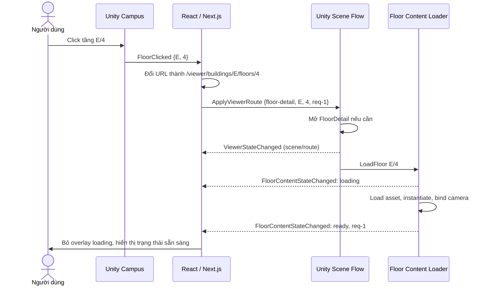

# Từ Unity đến Next.js: hướng dẫn đọc và vận hành dự án UIT-IOT-GIS

**Dành cho:** người đã biết Unity, C#, scene, prefab và Inspector, nhưng chưa từng làm Next.js.  
**Ngày tổng hợp:** 13/09/2026.  
**Phạm vi:** tổng hợp các tài liệu Markdown, plan, handoff trong repository và đối chiếu với mã nguồn, cấu hình, scene được lưu trên đĩa tại thời điểm viết.

Sau tutorial này, bạn có thể chạy phần web, hiểu vì sao URL điều khiển scene Unity, tìm đúng nơi sửa giao diện hoặc nội dung 3D, và biết cần build lại phần nào khi thay đổi dự án.

Các ví dụ thao tác dưới đây là hướng dẫn để bạn thực hành. Việc biên soạn tài liệu **không chạy lại Unity Play Mode, kiểm thử WebGL trên trình duyệt hay build ứng dụng**. Những kết quả PASS/FAIL trong handoff là ghi nhận của lần bàn giao tương ứng, không phải kết quả kiểm thử mới.

## Mục lục

1. [Dự án đang làm gì?](#bai-1)
2. [Chạy web lần đầu](#bai-2)
3. [Học vừa đủ JavaScript, React và Next.js](#bai-3)
4. [Bản đồ thư mục và nơi cần đọc](#bai-4)
5. [Vì sao đổi URL mà Unity không khởi động lại?](#bai-5)
6. [Theo dấu một lần chọn tầng từ đầu đến cuối](#bai-6)
7. [Đọc hợp đồng giao tiếp Unity–web](#bai-7)
8. [Hiểu phần Unity hiện tại](#bai-8)
9. [Tải prefab tầng và khởi tạo camera đúng lúc](#bai-9)
10. [Tọa độ: nền móng cho dữ liệu IoT/GIS](#bai-10)
11. [Build, đóng gói và phục vụ file](#bai-11)
12. [Ba bài thực hành nhỏ](#bai-12)
13. [Kiểm tra và tìm lỗi](#bai-13)
14. [Đọc lại các plan/handoff mà không nhầm trạng thái](#bai-14)
15. [Danh mục tài liệu nguồn](#nguon)

<a id="bai-1"></a>
## 1. Dự án đang làm gì?

UIT-IOT-GIS hiện có một ứng dụng xem campus 3D và chi tiết tầng của tòa nhà E. Giao diện ngoài cùng do web dựng; hình ảnh 3D và tương tác với mô hình do Unity dựng.

Hãy hình dung bạn đưa một Unity Player vào giữa một ứng dụng có thanh điều hướng, tiêu đề và danh sách tầng:

```text
Trình duyệt
┌─────────────────────────────────────────────────────────┐
│ React / Next.js: tiêu đề, điều hướng, trạng thái tải       │
│ ┌──────────────────────────────────┐ ┌────────────────┐ │
│ │ Unity WebGL canvas               │ │ Danh sách tầng │ │
│ │ Campus hoặc FloorDetail          │ │ E/12 ... E/G   │ │
│ │ Camera, collider, highlight, 3D   │ │ Nút Thử lại    │ │
│ └──────────────────────────────────┘ └────────────────┘ │
└─────────────────────────────────────────────────────────┘
               ↕ các thông điệp JSON
          Script C# ↔ JavaScript trong trình duyệt
```

Ở đây, **canvas** là vùng vẽ của trình duyệt mà Unity WebGL sử dụng. Nó không phải GameObject `Canvas` của Unity UI.

| Phần việc | Bên chịu trách nhiệm trong dự án |
| --- | --- |
| Camera, orbit/pan/zoom, raycast, hover, highlight tầng | Unity |
| Load scene Campus/FloorDetail, instantiate và giải phóng prefab | Unity |
| Thanh bên, breadcrumb, danh sách tầng, thông báo loading/error | React trong ứng dụng Next.js |
| URL, Back/Forward, mở thẳng một tầng từ đường dẫn | Next.js và trình duyệt |
| Phục vụ file player, StreamingAssets và bundle qua HTTP | Web server của ứng dụng khi chạy Next.js; cần cấu hình tương đương khi triển khai |
| Tra cứu tầng nào có mô hình 3D | `FloorContentRegistry` phía Unity |

**Phạm vi hiện tại cần nhớ:** web chấp nhận tòa nhà `E`, tầng `G` và `1`–`12`. Registry chỉ cấu hình mô hình cho **E/4 và E/6**. E/3, E/7 hoặc G vẫn là lựa chọn hợp lệ, nhưng phải hiện thông báo chưa có mô hình. URL hợp lệ và có asset 3D là hai điều kiện riêng.

Tên dự án có IoT/GIS, nhưng luồng đang được tài liệu hóa là viewer, navigation, tải mô hình và chuẩn bị hệ tọa độ. Các tài liệu này chưa chứng minh có hệ thống cảm biến trực tiếp, backend nghiệp vụ, cơ sở dữ liệu hay ánh xạ tọa độ địa lý đã hiệu chuẩn. Đừng hiểu metadata tọa độ là dữ liệu IoT đang chạy. [W4], [W5]

<a id="bai-2"></a>
## 2. Chạy web lần đầu

### 2.1. Chuẩn bị

Bạn cần một trình duyệt hỗ trợ WebGL, terminal như PowerShell, Node.js kèm npm và thư mục dự án hiện có. Node.js là môi trường chạy JavaScript ngoài trình duyệt; npm là công cụ cài các thư viện và chạy những lệnh dự án định nghĩa.

Các phiên bản khai báo tại thời điểm tổng hợp:

| Thành phần | Phiên bản từ dự án |
| --- | --- |
| Unity Editor | `6000.0.75f1` |
| Addressables | `2.9.1` |
| Input System | `1.19.0` |
| Next.js | `16.3.4` |
| React / React DOM | `19.2.8` |
| react-unity-webgl | Dải phiên bản `^10.2.0` |
| TypeScript / Tailwind CSS | Dải phiên bản `^5` / `^4` |

Nguồn phiên bản: [package.json](web/package.json), [manifest.json của Unity](UnityContent/Packages/manifest.json), [ProjectVersion.txt](UnityContent/ProjectSettings/ProjectVersion.txt). Dấu `^` cho phép npm chọn một số bản cập nhật tương thích; `package-lock.json` ghi chính xác cây thư viện đã khóa. Tài liệu đi kèm Next.js đang cài yêu cầu **Node.js tối thiểu 20.9**; dùng một bản Node.js còn được hỗ trợ và đáp ứng yêu cầu này.

### 2.2. Cài thư viện và mở server

Mở PowerShell tại thư mục gốc có cả `UnityContent` và `web`, rồi chạy từng lệnh:

```powershell
cd web
node --version
npm --version
npm ci
npm run dev
```

`npm ci` cài thư viện theo lockfile và tạo lại `node_modules`; cần mạng nếu thư viện chưa được cache. Với một môi trường đã cài đúng thư viện, các lần mở sau thường chỉ cần `npm run dev` trong `web`. Nếu PowerShell báo chặn chạy `npm.ps1`, có thể dùng `npm.cmd ci` và `npm.cmd run dev`.

Giữ terminal này mở. Truy cập [http://localhost:3000](http://localhost:3000). Nếu terminal thông báo một cổng khác, dùng URL được in ra. Nhấn `Ctrl+C` khi muốn dừng server.

Bạn **không cần tạo dự án bằng `create-next-app`** nữa vì repository đã chứa ứng dụng. Các lệnh npm trên cũng không mở hay build Unity Editor.

### 2.3. Kết quả nên quan sát

1. Mở `/` sẽ được chuyển tới `/viewer/campus`.
2. Khung giao diện web xuất hiện, rồi Unity tải player. Chỉ số phần trăm là tiến độ tải player ban đầu.
3. Khi Unity sẵn sàng và nhận route, Campus được hiển thị.
4. Thử mở [E/4](http://localhost:3000/viewer/buildings/E/floors/4), rồi [E/6](http://localhost:3000/viewer/buildings/E/floors/6). Đây là hai tầng dùng để kiểm tra mô hình.
5. Thử [E/3](http://localhost:3000/viewer/buildings/E/floors/3). Thông báo chưa có mô hình là kết quả dự kiến theo registry.

Repository có file WebGL và bundle dưới `web/public/unity`. Việc các file tồn tại không đảm bảo chúng được build từ source mới nhất; nếu giao diện chạy nhưng mô hình/camera lỗi, xem mục 11 và 13.

### 2.4. Các lệnh web khác có nghĩa gì?

Chạy trong `web`:

| Lệnh | Mục đích | So sánh để dễ nhớ |
| --- | --- | --- |
| `npm run dev` | Chạy môi trường phát triển; thay đổi giao diện thường được cập nhật tự động | Gần với vòng lặp sửa và xem nhanh trong Editor |
| `npm run lint` | Kiểm tra các quy tắc mã nguồn JavaScript/TypeScript | Một lớp kiểm tra coding rules |
| `npm run build` | Tạo bản build production của ứng dụng Next.js vào `.next` | Build phần web |
| `npm run start` | Chạy server từ bản web đã build thành công | Chạy bản web production ở máy local |

Muốn chạy thử production: dừng dev, chạy `npm run build`, sau đó `npm run start`. **Build Next.js không compile C# và không xuất Unity WebGL.**

<a id="bai-3"></a>
## 3. Học vừa đủ JavaScript, React và Next.js

### 3.1. Mỗi công cụ giải quyết việc gì?

| Khái niệm web | Cách liên hệ với Unity | Giới hạn của phép so sánh |
| --- | --- | --- |
| JavaScript | Ngôn ngữ viết logic web, như bạn dùng C# cho logic Unity | Chạy trong môi trường khác, không truy cập trực tiếp GameObject |
| TypeScript, file `.ts` | JavaScript có khai báo kiểu để kiểm tra lúc phát triển | Kiểu không tự kiểm tra JSON nhận từ bên ngoài khi chạy |
| React component | Khối giao diện tái sử dụng, có thể nghĩ gần với một prefab UI | Là hàm mô tả UI, không phải GameObject hoặc MonoBehaviour |
| JSX/TSX, file `.tsx` | Cách viết cây giao diện lồng nhau trong code | Cú pháp trông như HTML nhưng có biểu thức JavaScript |
| Props | Dữ liệu đầu vào được truyền khi dùng component | Component con nên coi props là dữ liệu chỉ đọc |
| State | Trạng thái mà giao diện cần theo dõi | Cập nhật qua setter để React biết cần vẽ lại |
| Hook | Hàm `use...` để dùng state, effect, context và logic React | Gọi ở cấp cao nhất của component/custom hook, không tùy tiện trong `if` hoặc vòng lặp |
| Effect, `useEffect` | Đăng ký sự kiện/đồng bộ với hệ thống ngoài, gần ý tưởng OnEnable/OnDisable | Không tương đương hoàn toàn; chạy lại theo dependency và có cleanup |
| Context | Nơi chia sẻ runtime cho nhiều component con | Phạm vi theo cây component, không phải biến global cho mọi thứ |
| Next.js | Bộ khung quanh React: route, layout, server và build | Không phải game engine |
| CSS / Tailwind | Thiết lập bố cục, màu, kích thước UI | Điều khiển DOM của web, không đổi vật liệu hay RectTransform Unity |
| `public` | Thư mục chứa file để web phục vụ trực tiếp | File trong đây không tự được import/compile như script |

### 3.2. Đọc một component như đọc một hàm C# dựng UI

Đây là **ví dụ minh họa**, không phải yêu cầu tạo thêm file:

```tsx
type FloorLabelProps = {
  floorId: string;
};

export function FloorLabel({ floorId }: FloorLabelProps) {
  return <span className="text-sm">Tầng {floorId}</span>;
}
```

Đọc từ trên xuống:

1. `type` định nghĩa hình dạng dữ liệu đầu vào. `floorId: string` nói rằng ID tầng là chuỗi.
2. `export` cho phép file khác import hàm này.
3. `{ floorId }` lấy trường `floorId` ra khỏi object props.
4. `return` trả về mô tả UI. `<span>` là một phần tử hiển thị chữ của web.
5. `{floorId}` chèn giá trị JavaScript vào giao diện.
6. `className="text-sm"` áp lớp Tailwind để chọn cỡ chữ.

Chỗ sử dụng sẽ viết `<FloorLabel floorId="4" />`. Component này hiển thị chữ “Tầng 4”; nó không load prefab tầng 4.

Các cú pháp bạn sẽ gặp trong source:

| Cú pháp | Cách đọc |
| --- | --- |
| `import { X } from "@/lib/..."` | Lấy `X` từ module; `@/` được cấu hình trỏ tới `web/src/` |
| `const name = ...` | Khai báo binding không gán lại; object được tham chiếu không vì thế tự bất biến |
| `(floor) => ...` | Hàm ngắn, tương tự lambda trong C# |
| `items.map(...)` | Biến mỗi phần tử thành một phần tử mới, thường dùng để dựng danh sách UI |
| `condition ? a : b` | Toán tử điều kiện như C# |
| `value?.field` / `value ?? fallback` | Truy cập khi có giá trị / dùng giá trị thay thế khi null hoặc undefined |
| `...route` | Chép các field của object route sang object mới |
| `<> ... </>` | Fragment: nhóm các phần tử mà không thêm một thẻ bao ngoài |
| `return null` | Component không thêm nội dung hiển thị |
| `async` / `await` / `Promise` | Chờ kết quả bất đồng bộ; có nét tương tự Task/await |

### 3.3. React không có `Update()` chạy mỗi frame cho component

Trong `UnityViewerRuntime.client.tsx`, bạn sẽ thấy:

```tsx
const [viewerStatus, setViewerStatus] =
  useState<ViewerRuntimeStatus>("initial-loading");
```

`viewerStatus` là trạng thái của lần render hiện tại; `setViewerStatus("loading-floor")` yêu cầu React cập nhật state và render lại phần UI liên quan. Một biến local thông thường không thay thế được cơ chế này. Xem nền tảng ở [React: State — A Component's Memory](https://react.dev/learn/state-a-components-memory).

Unity vẫn có vòng lặp render riêng trong canvas. React không phải vẽ lại component ở mỗi frame camera di chuyển. React chủ yếu phản ứng khi URL, tiến độ tải hoặc event từ Unity thay đổi.

Những hook còn lại trong runtime:

- `useRef`: giữ một giá trị qua các lần render mà cập nhật nó không tự yêu cầu render. Ví dụ bộ đếm request và ID request mới nhất.
- `useEffect`: đăng ký listener hoặc đồng bộ URL sang Unity; hàm `return` bên trong effect dùng để gỡ listener cũ.
- `useCallback`: giữ tham chiếu hàm ổn định khi các dependency không đổi.
- `useMemo`: lưu kết quả tính toán theo dependency, ví dụ nhãn trạng thái hoặc object context.
- `useContext`: đọc runtime chung từ Provider; `useUnityViewer()` là hook dự án bọc việc đọc này.

Khi đăng ký event, hãy nghĩ theo cặp “đăng ký/gỡ đăng ký”, tương tự `+=` và `-=` với C# event. Thêm listener mỗi lần render mà không cleanup có thể khiến một click bị xử lý nhiều lần.

### 3.4. Server Component và Client Component

Trong App Router, page/layout mặc định là Server Component. Khi cần state, event hoặc API trình duyệt, dự án dùng Client Component với chỉ thị `"use client"` đầu file. Client Component vẫn có thể được prerender thành HTML ở lần tải đầu; chỉ thị này không có nghĩa mọi dòng code luôn chỉ chạy trên browser. [Next.js: Server and Client Components](https://nextjs.org/docs/app/getting-started/server-and-client-components)

Áp vào dự án:

- Trang chi tiết tầng đọc tham số URL và kiểm tra ID ở page phía server.
- `UnityViewerRuntime`, `UnityViewerCanvas`, `UnityRouteSynchronizer` xử lý tương tác phía client.
- Hậu tố `.client.tsx` giúp con người nhận diện file. **Chỉ thị `"use client"` mới là phần khai báo ranh giới với Next.js.**
- WebGL thực sự chạy trong browser; không dùng GameObject/Unity API trực tiếp trong Server Component.

<a id="bai-4"></a>
## 4. Bản đồ thư mục và nơi cần đọc

Các đường dẫn trong tài liệu tính từ thư mục gốc repository, trừ đường dẫn `Assets/...` được ghi rõ là bên trong Unity.

```text
UIT-IOT-GIS/
├── TUTORIAL_UNITY_NEXTJS.md        Tài liệu này
├── UnityContent/                  Mở thư mục này bằng Unity Hub
│   ├── Assets/Scene/              Campus.unity, FloorDetail.unity
│   ├── Assets/Script/             C# runtime, editor tools, tests, doc
│   ├── Assets/Plugins/WebGL/      ViewerBridge.jslib
│   ├── Assets/Prefabs/Floor/      Prefab mô hình nguồn
│   ├── Assets/Content/            Wrapper tầng và registry
│   └── Assets/Resources/          Registry dự phòng cho runtime
└── web/                           Chạy lệnh npm tại đây
    ├── src/app/                   Route, layout, CSS toàn cục
    ├── src/components/            Giao diện và runtime Unity phía web
    ├── src/config/                Danh sách tầng, URL file WebGL
    ├── src/lib/                   Parse route và JSON bridge
    ├── src/types/                 Kiểu dữ liệu TypeScript
    ├── public/unity/              Player, StreamingAssets, content bundles
    ├── doc/                       Plan và handoff các phase
    ├── package.json               Thư viện và các lệnh npm
    ├── package-lock.json          Phiên bản thư viện được khóa
    ├── next.config.ts             Headers Brotli và rewrite URL content
    └── tsconfig.json              Cấu hình TypeScript, alias @/
```

| Bạn muốn tìm hoặc sửa việc gì? | Đọc file nào trước? |
| --- | --- |
| Điểm vào website `/` | [web/src/app/page.tsx](web/src/app/page.tsx) |
| Tiêu đề tab trình duyệt, HTML gốc | [web/src/app/layout.tsx](web/src/app/layout.tsx) |
| Chỗ giữ Unity runtime xuyên các route | [web/src/app/viewer/layout.tsx](web/src/app/viewer/layout.tsx) |
| Thanh trái, thanh trên, breadcrumb | [ViewerShell.tsx](web/src/components/layout/ViewerShell.tsx) |
| Danh sách và nhãn tầng | [buildings.ts](web/src/config/buildings.ts), [FloorNavigationPanel.tsx](web/src/components/floor/FloorNavigationPanel.tsx) |
| Tạo/đọc URL | [viewer-routes.ts](web/src/lib/viewer-routes.ts) |
| Định nghĩa payload, ID và trạng thái | [viewer.ts](web/src/types/viewer.ts) |
| Kiểm tra dữ liệu Unity gửi | [unity-bridge.ts](web/src/lib/unity-bridge.ts) |
| Giữ state và nhận/gửi message Unity | [UnityViewerRuntime.client.tsx](web/src/components/unity/UnityViewerRuntime.client.tsx) |
| Đồng bộ URL hiện tại | [UnityRouteSynchronizer.client.tsx](web/src/components/unity/UnityRouteSynchronizer.client.tsx) |
| Vẽ canvas và tiến độ player | [UnityViewerCanvas.client.tsx](web/src/components/unity/UnityViewerCanvas.client.tsx) |
| Loading/unavailable/error và nút Thử lại | [FloorContentStatusOverlay.tsx](web/src/components/floor/FloorContentStatusOverlay.tsx) |
| Màu và style toàn cục | [globals.css](web/src/app/globals.css) |
| Tên file Unity build | [unity-build.ts](web/src/config/unity-build.ts), [next.config.ts](web/next.config.ts) |

Hai file `CampusUnityCanvas.client.tsx` và `CampusUnityCanvasLoader.client.tsx` còn lưu cách nhúng canvas của giai đoạn đầu. Layout viewer hiện sử dụng bộ `UnityViewerRuntime` / `UnityViewerCanvas`. Đọc hai file cũ như lịch sử, đừng thêm một `useUnityContext()` thứ hai vào từng page. [W1], [W3]

<a id="bai-5"></a>
## 5. Vì sao đổi URL mà Unity không khởi động lại?

### 5.1. Route là gì?

Route là đường dẫn mà ứng dụng hiểu. App Router của Next.js ánh xạ thư mục tới URL; `page.tsx` khai báo trang, `layout.tsx` khai báo khung dùng chung. Phần đặt trong dấu `[]` nhận giá trị từ URL. [Next.js: Layouts and Pages](https://nextjs.org/docs/app/getting-started/layouts-and-pages)

| Đường dẫn trình duyệt | File xử lý trong `web/src/app` | Vai trò |
| --- | --- | --- |
| `/` | `page.tsx` | Chuyển tới Campus |
| `/viewer/campus` | `viewer/campus/page.tsx` | Không thêm overlay riêng |
| `/viewer/buildings/E/floors/4` | `viewer/buildings/[buildingId]/floors/[floorId]/page.tsx` | Nhận `E` và `4`, dựng UI chi tiết tầng |
| Mọi route viewer nói trên | `viewer/layout.tsx` | Bao chung runtime, canvas và shell |

`buildingId` và `floorId` là chuỗi. Tầng trệt dùng `"G"`; tầng 4 dùng `"4"`, không dùng `4`, `"04"` hoặc `"Tầng 4"` trong contract. Tên prefab `Floor_E_04` là quy ước asset riêng.

Trang chi tiết hiện khai báo `params` là `Promise` và dùng `await params`. Nếu URL khớp mẫu chi tiết nhưng ID không được hỗ trợ, page gọi `redirect("/viewer/campus")`. Một URL hoàn toàn ngoài các route đã định nghĩa vẫn có thể là trang 404.

### 5.2. Cây giao diện hiện tại

```text
RootLayout
└── ViewerLayout
    └── UnityViewerRuntime            Tạo và giữ một useUnityContext
        ├── UnityRouteSynchronizer   Lắng nghe pathname và isLoaded
        └── ViewerShell
            ├── Thanh trái / thanh trên
            ├── UnityViewerCanvas    Một Unity canvas dùng chung
            └── children             Nội dung thay theo page
                ├── CampusPage: null
                └── FloorDetailPage: panel tầng + status overlay
```

`children` là phần nội dung được nhét vào khung cha. `CampusPage` trả `null` nhưng bạn vẫn nhìn thấy Campus vì canvas đã nằm trong layout.

Có thể liên hệ shared layout với một khung ứng dụng sống lâu, còn page giống phần UI thay theo màn hình. Đây chỉ là cách hình dung: Next.js không gọi `DontDestroyOnLoad` của Unity. Hai cơ chế giữ trạng thái nằm ở hai môi trường khác nhau.

Khi dùng `Link` hoặc `router.push` để chuyển giữa các route thuộc cùng layout viewer, runtime/canvas được giữ trong cây giao diện. **F5/hard refresh sẽ khởi tạo lại trang và Unity**; rời hẳn layout viewer cũng không có bảo đảm giữ runtime đó.

### 5.3. URL giữ lựa chọn, Unity báo kết quả thực hiện

Nguyên tắc của dự án: **URL biểu diễn màn hình và tầng người dùng muốn xem**. Unity nhận lựa chọn, thực hiện, rồi báo trạng thái.

Do đó, click mô hình trong Unity không nên vừa tự chuyển scene ngay vừa đổi URL độc lập. Event `FloorClicked` đưa ý định sang web; web đổi URL; bộ đồng bộ gửi lại route chuẩn cho Unity. Cùng một đường xử lý được dùng cho click tầng, chọn menu, Back/Forward và mở deep link.

URL chỉ giữ `view`, `buildingId`, `floorId`; camera pose và trạng thái tải không nằm trong URL hiện tại. Gửi link tầng cho người khác không đồng nghĩa chia sẻ chính xác góc camera đang nhìn.

Nguồn triển khai: [W2], [W3], `viewer/layout.tsx`, `viewer-routes.ts`, `UnityViewerRuntime.client.tsx`.

<a id="bai-6"></a>
## 6. Theo dấu một lần chọn tầng từ đầu đến cuối

Ví dụ bạn đang ở Campus và nhấp tầng 4 của tòa E:



Nếu nơi đọc Markdown không hiển thị Mermaid, đọc chuỗi này: **click → event → URL → route command → scene → content → camera → ready**. Sơ đồ thể hiện các bước chính, không phải cam kết thứ tự từng callback trong cùng một frame.

### Bước 1 — Unity xác định tầng

Hệ thống hover/raycast nhận `HoverableFloor`. Khi nhấp hợp lệ, signal tầng được phát; `WebViewerBridge` chuyển thành JSON và gọi cầu nối JavaScript.

### Bước 2 — Web đổi URL

`UnityViewerRuntime` nghe `FloorClicked`, parse và kiểm tra schema/ID. Nếu hợp lệ và khác URL hiện tại, nó dùng `router.push(targetRoute, { scroll: false })`.

### Bước 3 — Bộ đồng bộ gửi route

`UnityRouteSynchronizer` thấy pathname đổi, đợi `isLoaded`, rồi gọi `dispatchRouteRequest`. Runtime tạo ID tăng dần như `req-1`, xóa lỗi cũ và chuyển UI sang `loading-floor` nếu đang chọn tầng.

### Bước 4 — Unity chọn scene

Web gọi method `ApplyViewerRoute` trên GameObject `_InitManager`; Unity chuyển lời gọi này trực tiếp tới component `ViewerSceneFlowController` có method đó. Controller quản lý chuyển scene và lựa chọn tầng; chuyển E/4 sang E/6 dùng cùng scene `FloorDetail`, thay content bên trong. `WebViewerBridge` phụ trách phát event từ Unity về web.

### Bước 5 — Loader chuẩn bị nội dung

`FloorContentLoader` tra registry. Với E/4, nó tải prefab bằng Addressables, tạo instance trong host của FloorDetail, xác nhận metadata, tính bounds và khởi tạo camera. Khi chuỗi này thành công, nó phát content `ready`.

Với E/3, registry ghi chưa cấu hình, nên kết thúc bằng `unavailable` và web hiển thị thông báo tương ứng. Không lấy model E/4 để giả làm E/3.

### Bước 6 — Web kiểm tra event thuộc đúng lượt yêu cầu

Web chỉ nhận content event khớp route hiện tại và `requestId` đang active. Nếu bạn đổi nhanh `4 → 6 → 4`, kết quả tải của lần chọn 4 đầu tiên không được làm UI của lần chọn 4 sau báo ready nhầm. `floorId` giống nhau chưa đủ; cần phân biệt cả lần yêu cầu.

Trong code hiện tại, `ViewerStateChanged` xử lý xác nhận Campus; **`floor-ready` được quyết định bởi `FloorContentStateChanged`**, không phải chỉ vì scene FloorDetail đã mở. Thanh phần trăm player đạt 100% cũng không có nghĩa mô hình tầng đã sẵn sàng.

<a id="bai-7"></a>
## 7. Đọc hợp đồng giao tiếp Unity–web

### 7.1. Cầu nối không phải HTTP API

Trong luồng này, code React và Unity WebGL chạy cùng trang trình duyệt. JSON đi qua bridge trong trang, không qua một REST server trung gian. HTTP dùng để tải trang, player và asset bundle.

| Hướng | Tên | Ý nghĩa |
| --- | --- | --- |
| Unity → web | `FloorClicked` | Người dùng chọn một tầng từ mô hình Campus |
| Web → Unity | `_InitManager.ApplyViewerRoute` | Áp lựa chọn đang được URL biểu diễn |
| Unity → web | `ViewerStateChanged` | Xác nhận scene/route đã được áp dụng |
| Unity → web | `FloorContentStateChanged` | Báo loading/ready/unavailable/error của mô hình tầng |
| Unity → web | `ViewerError` | Lỗi ở mức route/scene/bridge, có `code` và `message` |

Tên GameObject `_InitManager`, method và event là một phần của contract. Đổi tên ở một bên phải sửa bên còn lại và build lại những phần bị ảnh hưởng.

### 7.2. Ví dụ payload

Event từ Unity khi click:

```json
{
  "schemaVersion": 1,
  "buildingId": "E",
  "floorId": "4"
}
```

Lệnh web gửi để mở tầng:

```json
{
  "schemaVersion": 1,
  "requestId": "req-1",
  "view": "floor-detail",
  "buildingId": "E",
  "floorId": "4"
}
```

Dòng gọi thực tế trong web có dạng:

```tsx
sendMessage("_InitManager", "ApplyViewerRoute", JSON.stringify(payload));
```

`JSON.stringify` chuyển object JavaScript thành chuỗi JSON, gần với vai trò `JsonUtility.ToJson` trong Unity. `ApplyViewerRoute` nhận chuỗi và kiểm tra nó.

Ví dụ content đã sẵn sàng, dùng metadata mặc định của pilot:

```json
{
  "schemaVersion": 1,
  "requestId": "req-1",
  "buildingId": "E",
  "floorId": "4",
  "status": "ready",
  "contentVersion": 1,
  "coordinateFrameId": "E/4/floor-local",
  "coordinateFrameVersion": 1,
  "calibrationStatus": "Unverified"
}
```

Lệnh về Campus chỉ cần `schemaVersion`, `requestId`, `view: "campus"`. Content lỗi dùng `status: "error"`, `errorCode`, `errorMessage`; đừng nhầm với cặp `code`/`message` của event `ViewerError`.

### 7.3. Những điều cần giữ khi mở rộng

- `schemaVersion: 1` là phiên bản cấu trúc message, khác phiên bản content hoặc release bundle.
- TypeScript có kiểu `BuildingId`/`FloorId`, nhưng JSON từ Unity vẫn phải qua parser kiểm tra lúc chạy.
- Một số khai báo cho phép thiếu `requestId` để tương thích contract cũ. **Trong xử lý content hiện tại, khi web có active request thì event thiếu ID hoặc sai ID bị bỏ qua.**
- `.jslib` gọi `window.dispatchReactUnityEvent`; đây là cầu nối cho listener của `react-unity-webgl`.
- Trong Unity Editor không có trang React đi kèm; log/event giả lập trong Editor không kiểm chứng trọn cầu nối WebGL.

File đối chiếu: [WebViewerBridge.cs](UnityContent/Assets/Script/Bridge/WebViewerBridge.cs), [ViewerBridge.jslib](UnityContent/Assets/Plugins/WebGL/ViewerBridge.jslib), [unity-bridge.ts](web/src/lib/unity-bridge.ts), [viewer.ts](web/src/types/viewer.ts). [W2], [W3], [W4]

<a id="bai-8"></a>
## 8. Hiểu phần Unity hiện tại

### 8.1. Object nào sống qua scene?

Trong Unity, `_InitManager.prefab` là root quản lý dùng chung. `AppBootstrap` sở hữu việc gọi `DontDestroyOnLoad` và xử lý manager trùng. Bridge, scene controller và floor loader nằm cùng hệ quản lý này.

```text
_InitManager                         Sống qua chuyển scene
├── AppBootstrap
├── WebViewerBridge
├── ViewerSceneFlowController
├── FloorContentLoader
└── OrbitInput / OrbitCameraInputManager

Campus hoặc FloorDetail              Sở hữu object của scene đó
├── CampusOrbitRig                   Instance riêng từ prefab dùng chung
├── CampusViewBounds                 Reference tới geometry của scene
└── FloorDetailContentHost           Có trong FloorDetail
    └── ContentRoot
        └── Floor instance đang xem  Được tạo sau khi tải xong
```

**Không đưa orbit rig vào `_InitManager` chỉ để giữ camera qua scene.** Rig đang giữ reference tới bounds/content thuộc scene; thiết kế hiện tại giữ input publisher dùng chung nhưng tạo rig/camera đúng cho từng scene. Khi load scene `Single`, các object thuộc scene cũ bị hủy, manager sống tiếp. [U4], [U5], [W3]

Scene List lưu trong project hiện có:

| Index | Scene | Enabled |
| --- | --- | --- |
| 0 | `Assets/Scene/Campus.unity` | Có |
| 1 | `Assets/Scene/FloorDetail.unity` | Có |

Khi xuất WebGL, kiểm tra Scene List thực sự được active Build Profile sử dụng, đặc biệt nếu profile có cấu hình ghi đè.

### 8.2. Điều khiển camera hiện hành

| Thao tác | Hành vi |
| --- | --- |
| Kéo chuột trái | Orbit; có ngưỡng phân biệt click/drag |
| Kéo chuột phải hoặc giữa | Pan trên mặt phẳng XZ |
| Lăn chuột | Dolly zoom, đổi khoảng cách tới mục tiêu |
| Home | Đưa camera về overview |
| WASD, mũi tên, Shift | Không phải bộ điều khiển orbit hiện tại |

Con trỏ được giữ hiển thị và không khóa theo kiểu FPS. Input bắt đầu trên UI cần được chặn để thao tác menu không kéo camera. Ở phía web, lớp overlay bao ngoài có `pointer-events-none`, còn panel/nút dùng `pointer-events-auto`: vùng trống cho phép chuột đi tới canvas, vùng điều khiển nhận tương tác. Đây là xử lý hit test của trình duyệt, khác EventSystem của Unity.

Plan di chuyển đầu tiên mô tả CharacterController, WASD và `TestScene`; các script walking vẫn tồn tại trong repository. Đó là bước thử nghiệm trước khi chọn orbit cho viewer. [U1], [U2]

### 8.3. Hover và click tầng E hoạt động nhờ những gì?

Khi hover không hoạt động, kiểm tra chuỗi này trong Campus:

1. `Building_E` có `HoverableBuilding`.
2. Các object tầng có `HoverableFloor`, ID đúng từ G tới 12.
3. Collider của tầng/mesh con đúng layer `FloorHover`; setup loại các phần như stairs và `Mesh54` khỏi nhóm hover theo thiết kế.
4. Camera đang dùng có `PhysicsRaycaster` và event mask phù hợp.
5. Scene có EventSystem với `InputSystemUIInputModule` hoạt động.

Highlight dùng `MaterialPropertyBlock` và khôi phục trạng thái cũ để tránh sửa shared material của asset. Click hợp lệ là chuột trái và không phải thao tác drag.

`FloorNameParser` giúp lấy ID từ tên như `E_floor_4` lúc setup/`Reset()`. **Đổi tên object sau đó không đảm bảo field ID đã serialize cũng tự đổi**; kiểm tra Inspector khi author tầng. [U3]

Trong Editor riêng lẻ, click có thể chỉ ghi log outbound bridge. Không có React đổi URL và gửi lệnh trở lại, nên click không tự hoàn thành vòng điều hướng web. Để kiểm trọn luồng, chạy bản WebGL qua ứng dụng; nếu dùng Editor, cần harness gửi route phù hợp.

### 8.4. Các menu setup liên quan

Các tool nằm dưới `Tools → UIT Campus`:

| Menu | Vai trò |
| --- | --- |
| `Setup Movement Scene` | Tool walking lịch sử; tạo lại manager prefab, không chạy lại cho viewer hiện tại |
| `Setup Orbit Scene` | Tool dựng orbit ban đầu; tạo lại manager/rig, không chạy lại cho viewer hiện tại |
| `Setup Building E Floor Hover` | Gắn cấu hình hover tầng E |
| `Setup FloorDetail Orbit Scene` | Tool cũ cho scene văn phòng tĩnh, yêu cầu `MainOffice` |
| `Verify FloorDetail Orbit Scene` | Validator cũ cũng yêu cầu `MainOffice`, không phù hợp shell động hiện tại |
| `Phase 03 Setup/...` | Wrapper, registry, Addressables, host/camera wiring |

Không cần chạy tất cả menu để sử dụng project đã có setup. Hai tool dựng movement/orbit ban đầu ghi lại `_InitManager.prefab` với bootstrap/input và có thể làm mất bridge/controller/loader hiện có. FloorDetail hiện dùng shell động không có `MainOffice`, nên dùng validator Phase 03 theo mục 11.5 thay cho validator orbit cũ. Với công việc đọc/chạy dự án, ưu tiên kiểm tra cấu hình hiện tại.

<a id="bai-9"></a>
## 9. Tải prefab tầng và khởi tạo camera đúng lúc

### 9.1. FloorDetail là một scene khung

Ở giai đoạn trước, FloorDetail chứa model văn phòng tĩnh như `MainOffice`. Sau Phase 03, scene được chuyển thành khung chứa camera, ánh sáng và host; model của tầng được tải vào sau. Vì vậy mở FloorDetail trong Editor mà chưa gửi route có thể chỉ thấy scene trống đang chờ content.

Hai prefab pilot:

| Tầng | Prefab nguồn trong `UnityContent` | Wrapper Addressable | Address |
| --- | --- | --- | --- |
| E/4 | `Assets/Prefabs/Floor/Floor_E_04.prefab` | `Assets/Content/Floors/E/Floor_E_04.prefab` | `floors/E/4` |
| E/6 | `Assets/Prefabs/Floor/Floor_E_06.prefab` | `Assets/Content/Floors/E/Floor_E_06.prefab` | `floors/E/6` |

Wrapper là prefab bao ngoài mô hình nguồn:

```text
Floor_E_4                  Root theo quy ước transform identity
├── FloorContentMetadata    Component lưu ID/version/frame/geometryRoot
└── Geometry                Nhánh chứa geometry
    └── Prefab mô hình nguồn
```

Phần root ổn định giúp quản lý nội dung và tọa độ; geometry bên trong có thể giữ transform cần thiết của asset nguồn. Không tùy ý đổi scale/pivot của toàn bộ model chỉ để camera fit dễ hơn. Camera nên đo geometry thực của instance. [W4], [W5]

### 9.2. Hai danh mục có vai trò khác nhau

| Danh mục | Chứa gì? | Quyết định điều gì? |
| --- | --- | --- |
| Catalog tầng phía web: `viewer.ts`, `buildings.ts` | Các ID hợp lệ và nhãn hiển thị | URL nào được chấp nhận, menu có những tầng nào |
| Registry phía Unity: `FloorContentRegistry.asset` | Building/floor, `isConfigured`, tham chiếu Addressable prefab | Tầng nào có model để tải |

Registry chính ở `Assets/Content/Config/FloorContentRegistry.asset`, được gán vào manager prefab. Có bản dự phòng ở `Assets/Resources/FloorContentRegistry.asset`; loader dùng `Resources.Load` cho registry khi reference trực tiếp bị thiếu.

**Prefab tầng được tải bằng Addressables**, còn `Resources.Load` ở đây phục vụ registry fallback. Đừng copy model vào Resources rồi kỳ vọng luồng hiện tại tự tìm được.

Addressables “remote” trong dự án nghĩa là bundle được phục vụ ngoài player qua URL. Hiện có thể dùng cùng origin với web; không bắt buộc có tài khoản Unity Cloud/CDN riêng để chạy local.

### 9.3. Trình tự để một tầng được coi là ready

```text
Route mới
→ tìm registry entry
→ chưa cấu hình: unavailable
→ đã cấu hình: loading
→ Addressables.LoadAssetAsync<GameObject>
→ kiểm tra request còn là lựa chọn hiện tại
→ Instantiate dưới ContentRoot của host hiện tại
→ đọc FloorContentMetadata từ instance vừa tạo
→ host kiểm tra geometry, tính bounds, khởi tạo camera
→ thành công: ready
→ lỗi: cleanup và error
```

`FloorContentLoader` hiện giữ generation cho lựa chọn mới nhất và có worker tải nội dung. Kết quả cũ cần bị loại nếu người dùng đổi lựa chọn hoặc rời scene. Source cũng có ngưỡng chờ tải 60 giây và đường dọn handle hoàn thành muộn. Điều này không có nghĩa coroutine timeout đã hủy việc download ở tầng mạng; kiểm thử mạng chậm và retry vẫn cần thiết.

Trong cách dùng Addressables hiện tại, loader tải asset rồi `Instantiate` thủ công. Khi bỏ model, nó hủy instance và release load handle. Không đổi riêng cleanup sang `Addressables.ReleaseInstance` mà giữ nguyên cách load, vì hai mô hình sở hữu khác nhau.

### 9.4. Camera phải đợi geometry thật

| Thiết lập / thời điểm | Campus | FloorDetail |
| --- | --- | --- |
| Geometry có sẵn khi mở scene | Có geometry campus tĩnh | Chưa có model tầng |
| `CampusViewBounds.calculateOnAwake` | Cho phép đo ngay | `false` |
| `CampusOrbitCameraController.initializeOnStart` | Cho phép khởi tạo ngay | `false` |
| Thời điểm fit camera | Khi scene/geometry tĩnh sẵn sàng | Sau khi host bind instance thành công |

Source hiện có `TryBindContent`, `TryInitializeFromBounds` và `SuspendUntilContentReady`. Khi dọn content, camera trở về trạng thái chờ, xóa bounds cũ; khi có geometry mới, tính lại framing và giới hạn zoom.

Đây là bài học quen thuộc với Unity nhưng dễ gặp lại khi tích hợp web: **`Awake`/`Start` của scene không đợi một asset tải qua mạng**. Thêm `WaitForSeconds(1)` không bảo đảm model đã có. Bật lại component cũng không khiến `Start()` chạy lại mỗi lần; cần API khởi tạo/bind lại rõ ràng. [W6]

<a id="bai-10"></a>
## 10. Tọa độ: nền móng cho dữ liệu IoT/GIS

Một vị trí cảm biến từ bên ngoài không tự nhiên trùng với Unity world position. Dữ liệu có thể dùng centimet, có gốc ở góc phòng, hoặc có hướng trục khác model. `FloorCoordinateFrame` mô tả phép đổi từ hệ dữ liệu nguồn sang hệ local của tầng.

| Trường | Ý nghĩa |
| --- | --- |
| `frameId`, `frameVersion` | Nhận diện và phiên bản hệ tọa độ |
| `sourceUnits`, `sourceAxesDescription` | Mô tả đơn vị và hướng trục của dữ liệu nguồn |
| `sourceOrigin` | Điểm mốc trong tọa độ nguồn |
| `originInFloorLocal` | Vị trí điểm mốc đó trong local của wrapper |
| `basisX`, `basisY`, `basisZ` | Mỗi bước theo trục nguồn tương ứng vector nào trong local, gồm cả tỉ lệ đơn vị |
| `calibrationStatus`, `calibrationNote` | Tình trạng và ghi chú đối chiếu với số đo thực |

Hàm trong `FloorCoordinateMapper` dùng:

```text
d      = sourcePosition - sourceOrigin
pLocal = originInFloorLocal + basisX*d.x + basisY*d.y + basisZ*d.z
pWorld = floorInstanceTransform.TransformPoint(pLocal)
```

Ví dụ minh họa: nguồn dùng cm và cùng hướng trục Unity, gốc nguồn/local đều bằng 0. Đặt `basisX=(0.01,0,0)`, `basisY=(0,0.01,0)`, `basisZ=(0,0,0.01)`. Điểm nguồn `(100,0,200)` trở thành local `(1,0,2)` mét. Sau đó `TransformPoint` đưa nó theo vị trí/rotation/scale instance đang có trong scene.

Đổi riêng chuỗi `sourceUnits` từ `m` sang `cm` không tự thay đổi phép tính; các basis mới quyết định phép biến đổi số học. `IsFrameValid` kiểm tra giá trị hữu hạn và hệ trục không suy biến, không kiểm tra model có khớp một căn phòng ngoài đời.

Pilot dùng frame như `E/4/floor-local`, version `1`, mặc định mét và trạng thái **`Unverified`**. Hiển thị model đúng hoặc test toán học pass chưa đủ để đổi thành `Verified`; cần đo/đối chiếu mốc thực tế. Phép biến đổi này cũng chưa phải một phép chuyển kinh độ/vĩ độ hay hệ quy chiếu GIS hoàn chỉnh. [W4], [W5]

Đừng nhầm bốn loại phiên bản:

| Tên | Phiên bản của cái gì? |
| --- | --- |
| `schemaVersion` | Cấu trúc message Unity–web |
| `contentVersion` | Nội dung model/metadata của tầng |
| `coordinateFrameVersion` | Gốc, trục và quy ước hệ tọa độ |
| `p03-r001` | Nhãn release dùng khi đóng gói/phục vụ content |

<a id="bai-11"></a>
## 11. Build, đóng gói và phục vụ file

### 11.1. Có ba việc build riêng

| Bạn vừa thay đổi | Phần thường phải build/cập nhật |
| --- | --- |
| Chữ, màu, bố cục React | Web; dev thường cập nhật ngay, production cần `npm run build` |
| C# camera/bridge/loader, scene, cấu hình player | Unity WebGL player rồi chép output sang web |
| Prefab tầng, material/dependency, Addressable content | Theo workflow hiện tại: build Addressables và xuất player cùng release để đồng bộ content/catalog/settings |
| Registry được gán trực tiếp hoặc nằm trong Resources | Được đóng gói với player; thay đổi thường cần Unity player mới |
| Tên/path file player | `unity-build.ts` và headers tương ứng trong `next.config.ts` |

Khi sửa source C# để chữa camera rồi chỉ chạy `npm run build`, browser vẫn có thể đang chạy C# cũ trong file WebGL đã xuất trước đó. Đây là một trong những điều cần kiểm tra đầu tiên khi Editor và web cho kết quả khác nhau. Workflow cập nhật riêng remote content mà giữ nguyên player chưa được thiết lập/nghiệm thu trong phạm vi này; không giả định thay bundle là đủ.

### 11.2. `public` biến thành URL như thế nào?

Thư mục `web/public` là gốc file tĩnh. Ví dụ:

```text
File trên đĩa:
web/public/unity/campus/Build/UIT-GIS-0910_1.loader.js

URL tại máy local:
http://localhost:3000/unity/campus/Build/UIT-GIS-0910_1.loader.js
```

Không thêm `/public` vào URL. Đường dẫn bắt đầu bằng `/unity/...` lấy từ gốc website, nên vẫn hoạt động khi trang đang ở đường dẫn tầng rất sâu.

Cấu hình player hiện trỏ tới:

```text
/unity/campus/Build/UIT-GIS-0910_1.loader.js
/unity/campus/Build/UIT-GIS-0910_1.data.br
/unity/campus/Build/UIT-GIS-0910_1.framework.js.br
/unity/campus/Build/UIT-GIS-0910_1.wasm.br
/unity/campus/StreamingAssets
```

| File | Vai trò dễ nhớ |
| --- | --- |
| `.loader.js` | Khởi động quá trình tải Unity Player |
| `.framework.js.br` | Phần JavaScript runtime, được nén Brotli |
| `.wasm.br` | Mã WebAssembly của player, được nén Brotli |
| `.data.br` | Dữ liệu đóng trong player, được nén Brotli |
| `StreamingAssets/aa/...` | Settings/catalog/local bundle của Addressables |
| Content `.bundle` | Asset được tải riêng, ví dụ mô hình tầng |

Hiện StreamingAssets có `aa/settings.json`, `catalog.bin`, `catalog.hash` và bundle local. Không mặc định catalog phải có tên `catalog.json` khi tìm lỗi.

### 11.3. Vì sao cần Brotli headers?

`.br` là nội dung nén Brotli. Web server cần nói cho browser biết dữ liệu đã nén và loại dữ liệu sau giải nén. `next.config.ts` đang khai báo rõ cho ba file player:

| File | `Content-Encoding` | `Content-Type` |
| --- | --- | --- |
| `.data.br` | `br` | `application/octet-stream` |
| `.framework.js.br` | `br` | `application/javascript` |
| `.wasm.br` | `br` | `application/wasm` |

Khi đổi tên build, sửa cả URL trong `unity-build.ts` và các đường dẫn `source` trong cấu hình headers. Bundle Addressables nén LZ4 không vì thế là HTTP Brotli; không áp `Content-Encoding: br` cho toàn bộ `/unity`.

### 11.4. Release content hiện đang ở đâu?

File bundle của E/4 và E/6 hiện có ở cả:

```text
web/public/unity/content/p03-r001/WebGL/
web/public/unity/content/ContentRelease/WebGL/
```

Next.js có rewrite từ `/unity/content/ContentRelease/:path*` sang `/unity/content/p03-r001/:path*`. Đây là ánh xạ yêu cầu file ở server, khác chuyển route trang của người dùng. Do cả hai thư mục cùng có file, khi kiểm tra một build hãy xem URL thực trong Network và cấu hình catalog, không chỉ dựa vào alias.

`FloorContentAddress.Origin` lấy phần `scheme://host:port` của trang trong WebGL. Trong Editor/standalone helper mặc định `http://localhost:3000`. Vì vậy khi thử remote content trong Editor, chạy web ở cổng khác cần xem lại đường dẫn origin đang dùng.

Tại thời điểm đọc, Addressables settings trên đĩa dùng các biến như `[ContentRelease]` và `[BuildTarget]`, trong khi tool setup có thể ghi lại đường dẫn release cụ thể. Output có thể nằm ở `ServerData/WebGL` hoặc `ServerData/p03-r001/WebGL`; menu copy xử lý hai trường hợp này. **Luôn kiểm tra active profile, target, catalog và thư mục output thực sau build.**

### 11.5. Quy trình cập nhật Unity để chạy trên web

1. Mở project `UnityContent` bằng Unity `6000.0.75f1` và chờ compile xong. Muốn xuất WebGL, Editor cần module Web Build Support tương ứng.
2. Chọn platform/build target WebGL trong Build Profiles. Kiểm tra scene Campus trước, FloorDetail sau và cả hai được bật.
3. Thoát Play Mode, lưu các scene đang chỉnh, rồi mở `Assets/Scene/FloorDetail.unity`. Nếu setup đã tồn tại, dùng `Tools → UIT Campus → Phase 03 Setup → 5. Validate Setup` để kiểm tra trước. Nếu cần sửa riêng host/camera wiring, xem menu `4b. Wire FloorDetail Scene Only`. Các tool này có thể tự mở FloorDetail bằng `OpenScene(..., Single)` khi scene khác đang active mà không hỏi lưu thay đổi; menu 4b còn lưu scene sau khi sửa wiring.
4. Kiểm tra wrappers, registry và Addressables profile. Chỉ chạy các menu tạo dữ liệu khi thực sự muốn tạo/cập nhật dữ liệu đó.
5. Chạy `6. Build Addressables Content (WebGL)`. **Tên menu không tự đổi active target**; phải bảo đảm target đúng trước khi bấm. Khi thành công, tool hiện gọi copy output sang web. Menu `7. Copy Addressables Output to Web` cho phép copy lại riêng.
6. Xuất Unity WebGL player từ cùng cấu hình/content phù hợp vào một thư mục output riêng, chưa ghi đè player web đang dùng trong khi build. Kiểm tra output có `Build` và `StreamingAssets`; không chỉ copy bốn file player mà bỏ quên Addressables settings/catalog đi kèm.
7. Đưa output vào `web/public/unity/campus` theo cấu trúc đang dùng. Nếu tên player thay đổi, cập nhật URL và Brotli headers khớp file thật.
8. Khởi động lại Next.js sau thay đổi cấu hình nếu cần; kiểm tra Campus, E/4, E/6 và E/3 bằng browser. Sau đó chạy web build nếu chuẩn bị bản production.

Menu `Apply All and Validate`, `1. Setup Floor Wrappers` và `2. Setup Registry` hiện dựng lại dữ liệu pilot được viết cứng cho tầng 4/6. Chạy lại sau khi tự thêm tầng hoặc sửa metadata có thể ghi đè dữ liệu đã author. Không coi đây là bước bắt buộc mỗi lần build.

### 11.6. Khi đưa lên máy chủ

Ứng dụng hiện có route động, headers và rewrite của Next.js. Cần môi trường chạy/cung cấp đúng các hành vi này cùng file Unity; chỉ upload một file HTML từ Unity không tạo ra toàn bộ ứng dụng này.

Plan Phase 03 đề xuất quản lý release đồng bộ cho player, StreamingAssets, catalog và bundle. Cấu hình hiện vẫn dùng path chung `campus/Build` và `campus/StreamingAssets`, còn content có nhãn `p03-r001`. Vì vậy chưa thể xem việc version hóa toàn bộ bộ phát hành là đã hoàn tất.

Khi phát hành, ghi lại source revision hoặc thời điểm build, tên player, release content và kết quả kiểm tra. Kiểm cả khi cache trống lẫn cache bật để phát hiện tình trạng player cũ đi cùng catalog/bundle mới. [W4], [W6]

<a id="bai-12"></a>
## 12. Ba bài thực hành nhỏ

Các bài dưới đây để bạn thực hiện trên nhánh làm việc của mình. Chúng đi từ sửa web thuần túy tới hiểu cấu hình content Unity.

### Bài A — Đổi cách gọi tầng trệt trên UI

**Mục tiêu:** hiểu dữ liệu hiển thị khác ID kỹ thuật.

1. Mở `web/src/config/buildings.ts`.
2. Trong `formatFloorLabel`, đổi nhãn trả về cho ID `"G"` từ `"Tầng G"` thành `"Tầng trệt"`.
3. Giữ nguyên ID `"G"` trong `BUILDING_E_FLOOR_IDS`; danh sách này được khai báo ở `web/src/types/viewer.ts` và import vào `buildings.ts`.
4. Với dev server đang chạy, mở route `/viewer/buildings/E/floors/G`.

**Kết quả cần thấy:** nhãn menu/breadcrumb dùng formatter thay đổi, URL vẫn kết thúc bằng `/G`. Thông báo chưa có model là bình thường. Một số overlay đang ghép trực tiếp `Tầng {floorId}` nên chưa chắc đổi theo; đây là dấu hiệu giúp bạn tìm các nơi cần dùng chung formatter nếu muốn đổi nhãn toàn giao diện.

Bài này không cần build lại Unity vì chỉ sửa chữ trên web.

### Bài B — Thêm một lối tắt mở tầng 4

**Mục tiêu:** hiểu điều hướng chuẩn qua URL và giữ canvas chung.

Trong `ViewerShell.tsx`, `Link` đã được import. Thêm một link vào vùng điều hướng phù hợp; có thể dùng đoạn tối thiểu sau rồi chỉnh style theo giao diện:

```tsx
<Link href="/viewer/buildings/E/floors/4" prefetch={false}>
  Tầng 4
</Link>
```

Bấm link từ Campus và quan sát URL, status tải tầng, rồi nhấn Back. Không thêm canvas vào trang tầng và không gọi `sendMessage` riêng từ link này; `UnityRouteSynchronizer` đã xử lý việc gửi route.

**Kết quả cần thấy:** URL chuyển tới E/4, cùng runtime Unity nhận route và tải nội dung; Back quay lại URL trước. Kiểm tra trong Elements của DevTools rằng bạn không vô tình tạo canvas thứ hai.

### Bài C — Chuẩn bị để tầng 7 có mô hình

**Mục tiêu:** phân biệt “thêm một lựa chọn UI” với “cung cấp asset cho lựa chọn đó”. Tầng 7 đã nằm trong catalog web nên không cần tạo page riêng.

1. Author hoặc chọn đúng prefab mô hình tầng 7 trong Unity. Không đổi tên model tầng 4 thành tầng 7 để coi là hoàn tất.
2. Tạo wrapper theo quy ước các pilot; gắn `FloorContentMetadata` với `buildingId="E"`, `floorId="7"`, geometryRoot đúng và frame/version rõ ràng.
3. Đăng ký wrapper vào Addressables, ví dụ address `floors/E/7`, group/profile phục vụ content giống các tầng đã có.
4. Trong registry mà `_InitManager` thực sự dùng, gán reference prefab cho E/7 và bật `isConfigured`. Đồng bộ bản Resources fallback nếu vẫn giữ nó.
5. Bổ sung tool setup/validator nếu muốn việc tạo lại dữ liệu sau này cũng giữ E/7; tool pilot hiện mặc định chỉ cấu hình E/4 và E/6, validator còn mong E/7 chưa cấu hình.
6. Build content/catalog và player phù hợp với registry mới; cập nhật web output theo mục 11.
7. Mở `/viewer/buildings/E/floors/7`, kiểm model đúng, camera frame đúng, rồi đổi nhanh sang 4 và 6 để kiểm vòng đời.

**Kết quả cần thấy:** E/7 đi từ `loading` tới `ready` với metadata E/7; không còn `unavailable`. Nếu chỉ sửa React hoặc thêm URL thì không thể tạo ra mô hình 3D còn thiếu.

<a id="bai-13"></a>
## 13. Kiểm tra và tìm lỗi

### 13.1. Tìm lỗi theo thứ tự các lớp

Mở DevTools của trình duyệt bằng F12:

- **Console**: tương tự nơi xem log/error khi chạy, gồm lỗi JavaScript và log Unity WebGL.
- **Network**: xem request nào tải file, status HTTP, URL và response headers. `404` thường là không tìm thấy đường dẫn; `200` mới xác nhận nhận được response, chưa chứng minh Unity dùng nội dung đúng.
- **Elements**: xem DOM/canvas và các lớp overlay có chặn chuột hay che canvas không.

Đọc log theo chuỗi: **web route → player → bridge → scene → content → camera**. Nếu player chưa tải được, chưa nên sửa raycast tầng. Nếu route đúng nhưng E/3 unavailable, trước hết xem registry thay vì sửa camera.

| Triệu chứng | Kiểm tra trước | File/nơi liên quan |
| --- | --- | --- |
| `npm` không nhận diện được | Node/npm đã cài và terminal mới đã nhận PATH chưa | `node --version`, `npm --version` |
| Lệnh báo không thấy `package.json` | Terminal đang ở `web` hay root | `web/package.json` |
| `npm ci` báo lockfile không khớp | Có thay đổi dependency chưa được cập nhật lockfile không | `package.json`, `package-lock.json`; không vội xóa lockfile |
| Lint nói thiếu cấu hình ESLint | Checkout có `eslint.config.mjs` không | `.gitignore` hiện liệt kê `web/eslint.config.mjs`; máy đang đọc có file local nhưng checkout khác có thể thiếu |
| UI web lên nhưng player lỗi tải | URL file và status Network; headers Brotli/MIME | `unity-build.ts`, `next.config.ts`, `public/unity/campus` |
| File tải nhầm theo đường dẫn tầng | Có dùng URL tương đối thiếu `/` đầu không | Cấu hình URL player/content |
| Có scene FloorDetail nhưng không có model | Đang chọn tầng nào, registry có cấu hình không | E/4,E/6 có model; E/3/E/7/G chưa có theo baseline |
| Mọi tầng có model đều kẹt loading | Content request, catalog, log loader, requestId | `FloorContentLoader`, `UnityViewerRuntime` |
| Camera báo thiếu root/bounds khi mở FloorDetail | Dynamic policy, host wiring, bản player có chứa code mới không | `FloorDetailContentHost`, bounds/controller, scene serialized |
| Mở E/4 nhưng camera nhìn sai/vẫn giữ bounds cũ | Camera bind metadata từ instance, clear/reinitialize khi thay content | Host và controller |
| Click tầng trong Editor chỉ có log | Có chạy vòng React→route→Unity không | Editor riêng lẻ không có trang React |
| Click trong browser không đổi URL | FloorClicked có tới web, ID/schema hợp lệ, pointer có thành drag không | Hover, bridge, parser, Console |
| URL đổi nhưng Unity không phản ứng | Player loaded, receiver đúng `_InitManager`, method có trên root, Scene List | Bridge/controller, route synchronizer |
| Quay lại Campus bị lỗi input/camera | Có manager/input publisher trùng hoặc rig bị giữ qua scene không | `AppBootstrap`, scene hierarchy |
| Chuột bấm menu nhưng camera cũng kéo | Ranh giới overlay và input UI | CSS pointer events, Unity input manager |
| Editor đã sửa nhưng browser còn lỗi cũ | Đã export player mới và copy cùng StreamingAssets chưa | Build output, Network/cache |
| Đổi tầng làm Unity tải player lại | Runtime/canvas có bị đặt trong page hoặc remount không | `viewer/layout.tsx`, component tree |
| Bundle 404 | URL trong catalog có đúng release/target/origin không | Addressables profile, content output, rewrite |

Không dùng cách tắt toàn bộ log hoặc gắn tạm model vào scene để coi lỗi async loading đã được giải quyết. Tiêu chí là model thật tải đúng tầng và camera bind được geometry đúng.

### 13.2. Ma trận kiểm tra ngắn sau thay đổi

| Thao tác | Kết quả cần quan sát |
| --- | --- |
| Mở `/viewer/campus` | Một runtime/canvas, camera và hover hoạt động |
| Click E/4 | URL đúng, FloorDetail và model E/4, camera fit hợp lý |
| Chuyển E/4 → E/6 | Model mới đúng, model cũ được dọn, không reload player |
| Chọn E/3 hoặc E/7 theo registry baseline | Hiện unavailable, không giả model tầng khác |
| Từ unavailable chọn E/4 | Loader/camera phục hồi, kết thúc ready |
| Back/Forward | URL, panel và nội dung Unity đồng bộ |
| F5 ngay tại URL E/4 | Player khởi động lại rồi áp đúng deep link E/4 |
| Đổi nhanh 4 → 6 → 4 | Kết quả cuối thuộc request cuối, không nhận ready cũ |
| Về Campus khi content đang tải | Callback đến muộn không gắn model vào scene mới |
| Giả lập bundle lỗi/chậm rồi khôi phục | Có trạng thái lỗi; Thử lại tạo lượt mới, không cần reload toàn player |
| Kiểm với cache bật và cache trống | Cùng nội dung đúng release và hành vi |

Nút **Thử lại** gửi lại route hiện tại với `requestId` mới. Bộ đồng bộ route hiện ghi nhớ pathname đã gửi và không tự resend dựa trên timeout chờ `ViewerStateChanged`. Vì vậy nếu lệnh route bị mất trước khi Unity nhận, cần phân biệt với lỗi tải bundle; nút retry content không phải cơ chế tự phục hồi toàn bộ handshake.

Trong Unity có các source test: `ViewerNavigationTests`, `FloorNameParserTests`, `OrbitCameraInputManagerTests`, `FloorCoordinateMapperTests`, `FloorCameraLifecycleTests` dưới `Assets/Script/Tests/EditMode`. Khi chạy bằng Unity Test Runner, cần xem test có được discover và thực thi thực sự; sự tồn tại của file test không đồng nghĩa pass.

Nếu sửa web, chạy lint/build. Nếu sửa Unity, chạy kiểm tra Unity phù hợp và Play Mode. Trước nghiệm thu tích hợp, chạy browser với player xuất từ source cần kiểm. Ba mức bằng chứng này bổ sung cho nhau.

<a id="bai-14"></a>
## 14. Đọc lại các plan/handoff mà không nhầm trạng thái

### 14.1. Lộ trình dự án được các tài liệu ghi lại

| Giai đoạn | Ý định / kết quả kiến trúc | Cách hiểu khi đọc hiện tại |
| --- | --- | --- |
| Unity movement spike [U1] | Thử đi bộ trong campus bằng CharacterController | Lịch sử thử nghiệm, không phải controls viewer đang dùng |
| Orbit map camera [U2] | Dùng orbit/pan/zoom thay hướng walking | Là hướng camera hiện tại |
| Building E hover [U3] | Nhận diện tầng và highlight, click lúc đó ngoài scope | Hover còn liên quan; click đã được bổ sung ở giai đoạn sau |
| Small Phase 01 [W1] | Dựng shell Next.js và nhúng một Campus WebGL | Nền tảng web ban đầu, chưa có navigation bridge |
| Small Phase 02 [W2], [W3] | Một runtime, route Campus/FloorDetail, click và Back/Forward | Luồng route hiện tại; hạn chế content lúc đó đã được mở rộng |
| Sửa navigation, tích hợp orbit FloorDetail [U4], [U5] | Sửa vòng đời manager/camera và chuyển scene | Giữ nguyên nguyên tắc camera thuộc scene; mô tả thiếu bridge/model tĩnh là baseline cũ |
| Small Phase 03 [W4], [W5] | Prefab từng tầng, Addressables, registry, metadata và status | Pilot E/4/E/6; các tầng còn lại unavailable |
| Camera/content fix investigation [W6] | Phân tích race/lifecycle sau khi chuyển sang content async | Source hiện đã có nhiều cơ chế sửa; cần runtime evidence riêng |

“Small Phase 03” là mốc kỹ thuật nhỏ của luồng viewer; plan còn đặt nó trong **Phase 1 của proposal lớn**. Nó không đồng nghĩa đã làm xong mọi thứ của “Phase 3” toàn sản phẩm. Runtime editor tầng, tài liệu và database được plan để ở giai đoạn proposal sau. [W4]

### 14.2. Những chỗ tài liệu cũ và source hiện khác nhau

| Mô tả trong tài liệu cũ | Đối chiếu hiện tại |
| --- | --- |
| Phase 02 mô tả tầng 1–12 | Web và Unity hiện có thêm G, tổng 13 ID |
| Chưa có bridge/receiver hoặc duplicate guard sai | Source hiện có bridge, receiver và kiểm tra primary manager |
| FloorDetail chứa văn phòng tĩnh `MainOffice` | Scene hiện là host tải prefab động |
| Bounds tự tính trong Awake khi chưa có model | Có `calculateOnAwake=false` cho FloorDetail |
| Camera tự init trong Start, không phục hồi đúng khi thay model | Có deferred init, suspend và API khởi tạo lại từ bounds |
| Loader tự làm stale request bởi cleanup tăng token | Source đã tách desired generation và cleanup active content |
| Metadata camera lấy từ prefab asset | Source lấy metadata từ instance sau instantiate và bind qua host |
| Host không lưu reference đầy đủ | Có wiring/validation trong tool và reference được serialize trong scene |
| Web nhận content event thiếu requestId | Hiện loại event thiếu/sai ID khi đang có request active |
| Chưa có orbit/camera tests | Source hiện có các file test liên quan |

Những nhận xét trong cột phải là **đối chiếu source/asset**, không phải tuyên bố đã kiểm chứng toàn bộ race, leak, camera và WebGL runtime.

### 14.3. Độ tin cậy của một kết luận “đã xong”

Handoff Phase 02 ghi build web pass nhưng lint fail và chưa có kiểm chứng Unity/browser. Handoff Phase 03 ghi lint/build/compilation pass, trong khi phần build/export có mục mới ở trạng thái tool sẵn sàng và còn hướng dẫn thao tác tiếp. Camera-fix plan sau đó ghi nhận các lỗi source/scene cần sửa.

Vì vậy, khi tiếp nhận dự án:

1. Dùng **plan** để hiểu lý do chọn kiến trúc và phạm vi mong muốn.
2. Dùng **handoff** để biết người thực hiện đã làm/kiểm gì tại mốc đó.
3. Dùng **source và cấu hình hiện tại** để xác định cơ chế đang có.
4. Dùng **kết quả chạy với đúng binary/release** để kết luận tính năng thực sự hoạt động.

Các chỉ dẫn “không build trong task này”, tên branch hoặc số commit cũ trong một plan là ngữ cảnh công việc lúc đó, không phải quy tắc vận hành vĩnh viễn cho mọi lần sửa dự án.

<a id="nguon"></a>
## 15. Danh mục tài liệu nguồn

Các ký hiệu như [W4] và [U2] trong tutorial trỏ về tài liệu ở bảng này. Các plan/handoff là nguồn lịch sử; những chỗ xác nhận hiện trạng đã được đối chiếu thêm với code và asset được liên kết trong từng bài.

### Tài liệu web

| Ký hiệu | Tài liệu | Nội dung được tổng hợp |
| --- | --- | --- |
| W1 | [Phase 01: Next.js Unity campus shell](web/doc/phase_01_nextjs_unity_campus_shell_plan.md) | Bố cục web, nhúng player, loading, phạm vi ban đầu |
| W2 | [Phase 02: campus/floor navigation plan](web/doc/phase_02_campus_floor_detail_navigation_plan.md) | Route, bridge, một runtime, menu và deep link |
| W3 | [Phase 02: implementation handoff](web/doc/phase_02_implementation_handoff.md) | Cấu trúc đã triển khai, contract, kết quả kiểm và hạn chế tại mốc bàn giao |
| W4 | [Phase 03: floor prefab loading plan](web/doc/phase_03_floor_prefab_loading_plan.md) | Addressables, registry, tọa độ, version, loading/error/retry, phạm vi tiếp theo |
| W5 | [Phase 03: implementation handoff](web/doc/phase_03_implementation_handoff.md) | Pilot E/4/E/6, automation, file triển khai và hướng dẫn Editor |
| W6 | [Phase 03: floor content/camera fix plan](web/doc/phase_03_floor_content_camera_fix_plan.md) | Phân tích lifecycle, token, instance bounds, wiring, đóng gói và tiêu chí kiểm thử |

### Tài liệu Unity

| Ký hiệu | Tài liệu | Nội dung được tổng hợp |
| --- | --- | --- |
| U1 | [Unity campus movement setup plan](UnityContent/Assets/Script/doc/unity_campus_movement_setup_plan.md) | Thử nghiệm walking và nền tảng tổ chức input |
| U2 | [Orbit map camera branch plan](UnityContent/Assets/Script/doc/orbit_map_camera_branch_plan.md) | Chuyển sang orbit, camera bounds và thao tác chuột |
| U3 | [Building E floor hover highlight plan](UnityContent/Assets/Script/doc/building_e_floor_hover_highlight_plan.md) | Parsing ID tầng, collider/layer, EventSystem và highlight |
| U4 | [Campus/floor detail navigation fix plan](UnityContent/Assets/Script/doc/campus_floor_detail_navigation_fix_plan.md) | Vòng điều hướng, receiver, manager và tích hợp build |
| U5 | [Floor detail orbit camera integration plan](UnityContent/Assets/Script/doc/floor_detail_orbit_camera_integration_plan.md) | Camera thuộc scene, input dùng chung và lịch sử scene FloorDetail |

### README, hướng dẫn công cụ và tài liệu nền

- [web/README.md](web/README.md): README mẫu của Next.js; hữu ích cho lệnh chạy cơ bản, nhưng chưa phản ánh đầy đủ cấu trúc `src/app` và tích hợp Unity hiện tại.
- [web/AGENTS.md](web/AGENTS.md): hướng dẫn cho coding agent đọc tài liệu Next.js đúng bản trong `web/node_modules/next/dist/docs` trước khi viết code. Đây không phải thành phần gameplay hay thiết lập mà người xem ứng dụng phải làm.
- [web/CLAUDE.md](web/CLAUDE.md): tham chiếu tới `AGENTS.md`, không có một kiến trúc ứng dụng riêng.
- Tài liệu đi kèm Next.js đã đối chiếu: `01-app/01-getting-started/01-installation.md`, `03-layouts-and-pages.md`, `05-server-and-client-components.md`, và `01-app/03-api-reference/03-file-conventions/public-folder.md` dưới `web/node_modules/next/dist/docs`. Thư mục này xuất hiện sau khi cài dependency.
- Các liên kết Next.js/React trong phần giải thích dùng tài liệu chính thức để học khái niệm. Khi chỉnh code dự án, ưu tiên API và phiên bản đang khóa trong repository; không tự nâng package chỉ để khớp ví dụ mới trên mạng.

[W1]: web/doc/phase_01_nextjs_unity_campus_shell_plan.md
[W2]: web/doc/phase_02_campus_floor_detail_navigation_plan.md
[W3]: web/doc/phase_02_implementation_handoff.md
[W4]: web/doc/phase_03_floor_prefab_loading_plan.md
[W5]: web/doc/phase_03_implementation_handoff.md
[W6]: web/doc/phase_03_floor_content_camera_fix_plan.md
[U1]: UnityContent/Assets/Script/doc/unity_campus_movement_setup_plan.md
[U2]: UnityContent/Assets/Script/doc/orbit_map_camera_branch_plan.md
[U3]: UnityContent/Assets/Script/doc/building_e_floor_hover_highlight_plan.md
[U4]: UnityContent/Assets/Script/doc/campus_floor_detail_navigation_fix_plan.md
[U5]: UnityContent/Assets/Script/doc/floor_detail_orbit_camera_integration_plan.md
